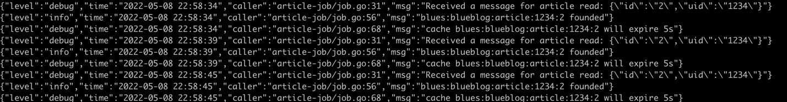

# blueblog

Blue系列微服务-博客系统

## 文件目录

- api 接口定义
- assets 静态文件资源
- cmd 命令行main入口
- configs 配置文件
- deploy 容器化部署配置文件
- docs 文档
- internal 代码目录
    - app 应用代码
        - controller 控制层
        - service 服务层
        - repository 持久层
    - pkg 应用公共组件
- output 工程编译产出
- pkg 工程公共组件
- vendor 依赖包

## 应用

| app | description |
| --- | --- |
| blueblog-interface | 请求接入，预处理，用户鉴权等 |
| blueblog-service | 业务处理 |
| blueblog-job | 流式任务处理 |
| blueblog-task | 定时任务处理 |
| blueblog-admin | 运营平台 |

## 数据流

blueblog-interface 请求入口，通过grpc请求blueblog-service


blueblog-service 处理实际请求
- 针对写请求，封装消息发送至RabbitMQ
- 针对读请求，
  - 首先查询Cache in Redis
  - Cache Miss后，直接查询DB in MySQL，同时通过goroutine，封装消息发送至RabbitMQ

blueblog-job 流式任务处理，监听RabbitMQ
- 针对写类型的消息，写入DB，并刷新Cache
- 针对读类型的消息，读取DB并刷新Cache
  - 为了避免缓存击穿，如果是不存在的查询记录，也会Cache，记为NotExist
- Cache 存活周期为 5s

blueblog-task 定时任务处理
- 考虑开发一些预加载的功能

blueblog-admin 运营平台
- 上帝视角的数据运营中心

## 进展与示例

**MySQL数据准备**

```mysql
-- auto-generated definition
create table article
(
    id          varchar(32)                         not null,
    uid         varchar(128)                        not null,
    title       varchar(255)                        not null,
    content     text                                not null,
    create_time timestamp default CURRENT_TIMESTAMP not null,
    constraint article_id_uindex
        unique (id)
)
    charset = utf8;

alter table article
    add primary key (id);

INSERT INTO article (id, uid, title, content, create_time) VALUES ('1', '1234', '标题1', '内容1', '2022-05-08 19:38:09');
INSERT INTO article (id, uid, title, content, create_time) VALUES ('2', '1234', '标题29809890', '内容23', '2022-05-08 19:38:27');
INSERT INTO article (id, uid, title, content, create_time) VALUES ('3', '4321', '标题1', '内容2', '2022-05-08 19:38:39');
```

**修改配置文件**

主要是端口和依赖服务的地址

**运行**

```shell
go mod tidy
go mod vendor
# 分别开3个终端执行
go run cmd/blueblog-interface/blueblog-interface.go
go run cmd/blueblog-job/blueblog-job.go
go run cmd/blueblog-service/blueblog-service.go
```

**示例**

目前仅做了一个读请求的接口

blueblog-interface http地址为 127.0.0.1:9091
blueblog-service grpc地址为 127.0.0.1:9093

例如查询uid为1234、id为2的文章详情

```shell
while True; do curl -i 127.0.0.1:9091/article/1234/2; done
```

blueblog-interface请求blueblog-service


blueblog-service接收请求，分两种情况，1、cache miss 2、cache in


blueblog-job监听消息队列，针对cache miss，会query db，cache的存活时间为5s


blueblog-task和blueblog-admin暂未开发
- blueblog-task 想的功能稍微高级，暂无经验，周期太长
- blueblog-admin 简单点其实就是无任何鉴权的增删改查+前端

关于grpc返回给客户端的error，客户端无法处理的问题：

先插个眼：https://studygolang.com/articles/14453